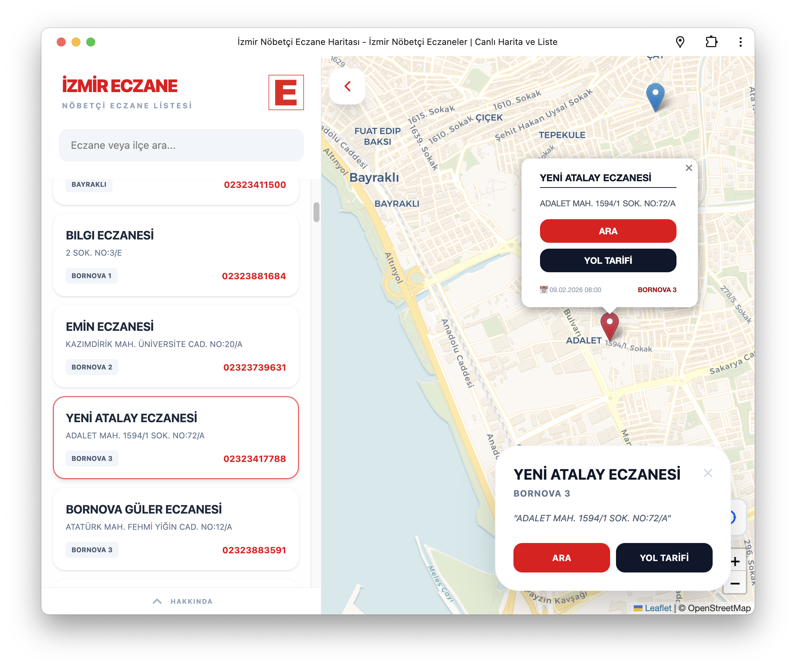
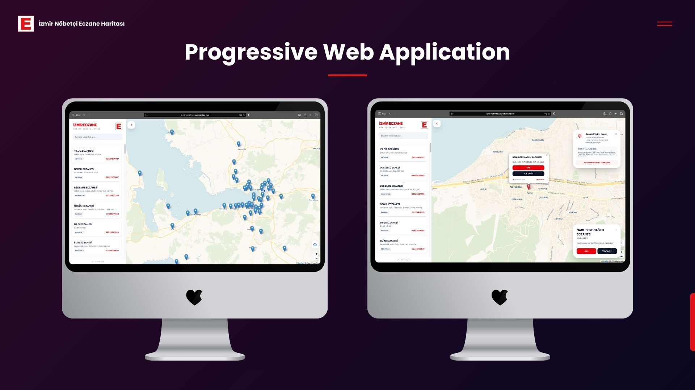
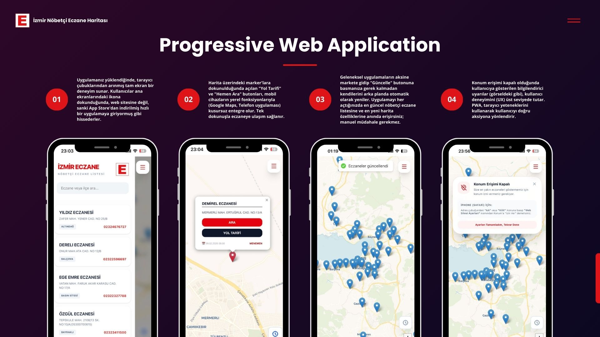

# 📍 İzmir Nöbetçi Eczane Haritası


İzmir genelindeki nöbetçi eczaneleri ilçe sınırlarına bağlı kalmaksızın, kullanıcıyı merkeze alan bir deneyimle sunan
modern bir web uygulamasıdır.

<p align="center">
  
</p>


## 📖 Genel Bakış

Geleneksel nöbetçi eczane listeleri genellikle ilçe bazlı arama yapmayı zorunlu kılar. Ancak İzmir gibi metropollerde,
özellikle **Bayraklı (Mansuroğlu)** ve **Bornova** gibi sınırların iç içe geçtiği bölgelerde, kullanıcılar hangi
listenin kendilerine en uygun olduğunu bulmakta zorluk çekmektedir.

Bu proje, İzmir Büyükşehir Belediyesi'nin verilerini kullanarak tüm nöbetçi eczaneleri tek bir interaktif harita
üzerinde toplar. Böylece ilçe seçimine gerek kalmadan, sadece konuma odaklanarak en hızlı çözüme ulaşmanızı sağlar.

## ✨ Öne Çıkan Özellikler

- **Bölge Bağımsız Görüntüleme:** Tüm İzmir nöbetçi eczanelerini tek bir ekran üzerinden harita üzerinde görün.
- **Canlı Konum Takibi:** "Konumuma Dön" butonu ile mevcut yerinizi ve çevrenizdeki eczaneleri anında bulun.
- **Hızlı Filtreleme:** Eczane adı veya bölge bazlı anlık arama desteği.
- **Direkt Erişim:** Mobil cihazlar üzerinden tek tuşla arama ve Google Haritalar ile yol tarifi entegrasyonu.
- **Dinamik Tasarım:** Tailwind CSS v4 ile geliştirilmiş, tamamen mobil uyumlu (responsive) modern arayüz.

<p align="center">
  
</p>

## 📱 Modern Web Yetenekleri

- **Progressive Web App (PWA):** Uygulamayı tarayıcı üzerinden cihazınıza yükleyebilir, ana ekranınızdan tek tıkla ulaşabilirsiniz.
- **Automated CI/CD:** GitHub Actions entegrasyonu ile her `push` işleminde kod otomatik olarak test edilir (Lint & Type Check) ve hatasız ise GitHub Pages üzerinde yayına alınır.
- **Mobile First:** Sadece responsive tasarım değil, mobil cihazlarda "native app" deneyimi sunan arayüz optimizasyonları.

<p align="center">
  
</p>

## 🛠️ Teknik Altyapı

- **Framework:** React 18 & TypeScript
- **Build Tool:** Vite
- **CI/CD:** GitHub Actions (Multi-stage pipeline)
- **Harita Motoru:** Leaflet & React-Leaflet
- **Styling:** Tailwind CSS v4
- **Veri Kaynağı:** İzmir Büyükşehir Belediyesi Açık Veri Portalı API

## 🔗 Canlı Uygulama
Uygulamayı buradan inceleyebilirsiniz: [izmir-nobetci-eczane-haritasi.live](https://izmir-nobetci-eczane-haritasi.live)

## 🚀 Kendi Versiyonunuzu Çalıştırma

Projeyi yerel ortamınızda ayağa kaldırmak için:

1. Projeyi bilgisayarınıza indirin:
   ```bash
    git clone [https://github.com/AtaCanYmc/izmir-nobetci-eczane-haritasi.git](https://github.com/AtaCanYmc/izmir-nobetci-eczane-haritasi.git)
    ```
2. Proje dizinine gidin:
   ```bash
    cd izmir-nobetci-eczane-haritasi
    ```
3. Bağımlılıkları yükleyin:
   ```bash
    npm install
    ```
4. Uygulamayı başlatın:
   ```bash
    npm run dev
    ```
5. Tarayıcınızda `http://localhost:5173` adresine gidin.

## 📕 Kaynak API:
- İzmir Büyükşehir Belediyesi Açık Veri Portalı: [https://data.izmir.bel.tr/](https://data.izmir.bel.tr/)
- Nöbetçi Eczane Verisi API'si: [https://data.izmir.bel.tr/dataset/izmir-nobetci-eczaneler](https://data.izmir.bel.tr/dataset/izmir-nobetci-eczaneler)

## 🤝 Katkıda Bulunma
Bu projeye katkıda bulunmak isterseniz, lütfen bir pull request gönderin veya bir konu açarak önerilerinizi paylaşın. Her türlü katkıya açığım :)

## 📄 Lisans
Bu proje MIT Lisansı altında lisanslanmıştır. Daha fazla bilgi için `LICENSE` dosyasına bakabilirsiniz.