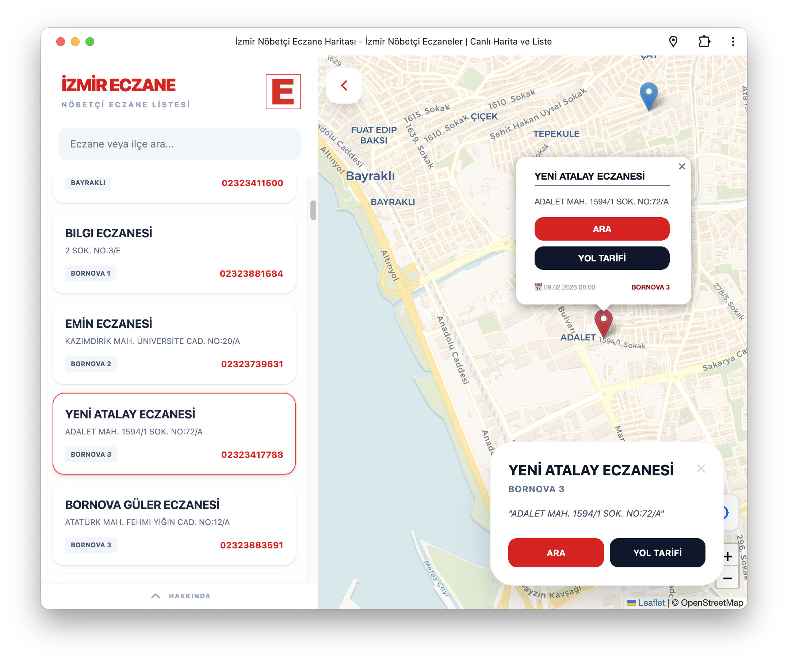
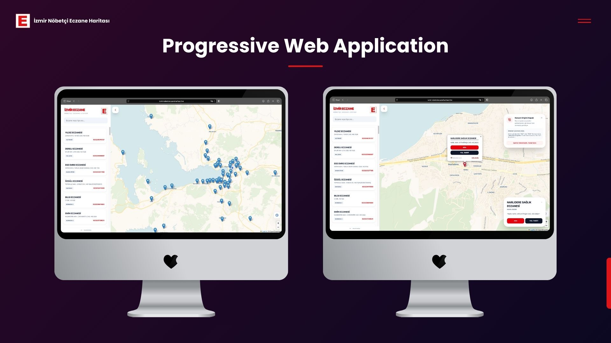
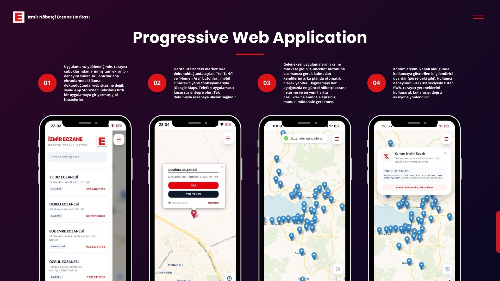

<div align="center">
  
  
  # 📍 İzmir Nöbetçi Eczane Haritası
  
  **İzmir genelindeki nöbetçi eczaneleri ilçe sınırlarına bağlı kalmaksızın, kullanıcıyı merkeze alan bir deneyimle sunan modern bir web uygulamasıdır.**

  <p align="center">
    <a href="https://github.com/AtaCanYmc/izmir-nobetci-eczane-haritasi/actions/workflows/deploy.yml"></a>
    
    
    
    
  </p>
</div>

---

<p align="center">
  
</p>

## 📖 Genel Bakış

Geleneksel nöbetçi eczane listeleri genellikle ilçe bazlı arama yapmayı zorunlu kılar. Ancak İzmir gibi metropollerde, özellikle **Bayraklı (Mansuroğlu)** ve **Bornova** gibi sınırların iç içe geçtiği bölgelerde, kullanıcılar hangi listenin kendilerine en uygun olduğunu bulmakta zorluk çekmektedir.

Bu proje, İzmir Büyükşehir Belediyesi'nin verilerini **`izmir-open-data-js`** açık kaynak SDK'sı ile doğrudan çekerek tüm nöbetçi eczaneleri tek bir interaktif harita üzerinde toplar. İlçe seçimine gerek kalmadan, sadece konuma odaklanarak en hızlı çözüme ulaşmanızı sağlar.

---

## ✨ Öne Çıkan Özellikler

- **📦 `izmir-open-data-js` SDK Gücü:** Proje tamamen bu kütüphane üzerine inşa edilmiştir. Ham fetch çağrıları yerine tiplendirilmiş, stabil ve profesyonel bir veri katmanı kullanılır.
- **⚡ Akıllı Veri Yönetimi:** `TanStack Query` sayesinde eczane verileri 15 dakika boyunca akıllıca önbelleklenerek gereksiz ağ trafiği önlenir.
- **🎨 Karanlık / Aydınlık Mod (Dark Theme):** Göz yormayan şık tasarım. Harita katmanları (`Voyager` / `Dark Matter`) temaya uygun olarak otomatik değişir.
- **📥 Harita ve Veri İndirme (Export):** İstediğiniz eczane görünümünü **PNG** olarak indirin, veya verileri **JSON, CSV, GeoJSON** formatında cihazınıza kaydedin. Hatta internetsiz çalışabilen bir **HTML** harita kopyası bile alabilirsiniz.
- **📍 Bölge Bağımsız & Canlı Konum:** Tüm İzmir'i tek ekranda görün. "Konumuma Dön" butonu ile mevcut yerinizi ve çevrenizdeki eczaneleri anında bulun.
- **🔎 Hızlı Filtreleme:** Eczane adı veya bölge bazlı anlık arama desteği.

<p align="center">
  
</p>

---

## 📱 Modern Web Yetenekleri ve SEO

- **Progressive Web App (PWA):** Uygulamayı tarayıcı üzerinden cihazınıza yükleyebilir, ana ekranınızdan bir Native App gibi ulaşabilirsiniz. 
- **Akıllı Kurulum Asistanı:** Siteye ilk giren ziyaretçilere cihazlarına uygun kurulum adımları (Android Install Prompt veya iOS Safari yönergeleri) şık bir arayüzle sunulur.
- **SEO & Erişilebilirlik:** `react-helmet-async` ile dinamik meta etiketleri, `sitemap.xml` ve `humans.txt` entegrasyonu ile arama motorlarında tam görünürlük.
- **Gizlilik Odaklı Analitik:** Çerezsiz analiz araçlarıyla hangi özelliklerin daha çok kullanıldığı (örn. hangi verinin indirildiği) gizlilik ihlali olmadan takip edilir.

<p align="center">
  
</p>

---

## 💻 Geliştiriciler İçin (`izmir-open-data-js`)

Bu uygulama, İzmir Büyükşehir Belediyesi Açık Veri Portalı verilerini sarmalayan açık kaynaklı bir SDK olan **`izmir-open-data-js`** kullanmaktadır.

Kendi projenizde kullanmak için:
```bash
npm install izmir-open-data-js
```

```javascript
import { IzmirAPI } from "izmir-open-data-js";

const api = new IzmirAPI();
// Tüm nöbetçi eczaneleri getir
const eczaneler = await api.eczaneler.getNobetciList();
```
*Daha fazla bilgi için uygulamanın sağ üst köşesindeki "Geliştiriciler İçin (< >)" butonuna tıklayabilirsiniz.*

---

## 🛠️ Teknik Altyapı

- **Framework:** React 18 & TypeScript
- **Veri ve SDK:** `izmir-open-data-js` & `@tanstack/react-query`
- **Build Tool & PWA:** Vite & `vite-plugin-pwa`
- **Harita Motoru:** Leaflet & React-Leaflet
- **Styling:** Tailwind CSS v4
- **Dışa Aktarım:** `html2canvas` (Görsel İndirme)
- **CI/CD:** GitHub Actions (Multi-stage pipeline ile otomatik GitHub Pages deploy)

---

## 🚀 Kendi Versiyonunuzu Çalıştırma

1. Projeyi bilgisayarınıza indirin:
   ```bash
   git clone https://github.com/AtaCanYmc/izmir-nobetci-eczane-haritasi.git
   ```
2. Bağımlılıkları yükleyin:
   ```bash
   cd izmir-nobetci-eczane-haritasi
   npm install
   ```
3. Uygulamayı başlatın:
   ```bash
   npm run dev
   ```

---

## 🔗 Linkler ve Kaynaklar
- **Canlı Uygulama:** [izmirnobetcieczaneharitasi.live](https://izmirnobetcieczaneharitasi.live)
- **Açık Veri Portalı:** [data.izmir.bel.tr](https://data.izmir.bel.tr/)
- **API Kaynağı:** [Nöbetçi Eczane Verisi API'si](https://data.izmir.bel.tr/dataset/izmir-nobetci-eczaneler)

<br/>
<p align="center">
  Her türlü katkıya (Pull Request veya Issue) açığım! :) <br/>
  <i>Apache 2.0 Lisansı altında lisanslanmıştır.</i>
</p>